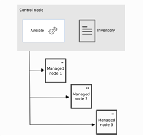

# Ansible 소개
## 개요
***Ansible = CODE 로 INFRA 관리(IaC)***
- 리눅스 시스템 관리와 자동화
    - 코드로 인프라 관리 하기 때문에 인적 오류 완화 가능
- Ansible 특징
    - 오픈소스 자동화 플랫폼
    - no agent(SSH 사용)
    - playbook을 실행하는 자동화 엔진
- Ansible 장점
    - 다양한 플랫폼 지원(리눅스, 유닉스, 윈도우, CISCO, 클라우드사)
    - 가동성 높은 자동화(.yml,.js)
    - 동적 인벤토리 지원(자동 업데이트)
    - 다른 시스템과 쉽게 통합되는 오케스트레이션
    - 최종적인 상태가 동일==역등성

- Ansible 개념 및 아키텍쳐
    - 제어 노드, 관리 대상 호스트
        - 제어 노드 : 앤서블 
        - 관리 대상 호스트 : 관리 대상이 되는 서버

- Ansible 사용 사례
    - 구성관리
    - 애플리케이션 배포
    - 프로비져닝
    - CI/CD
    - 보안 및 규정 준수
    - 오케스트레이션
        1.vargrant + ansible, terraform + ansible 등

## Ansible 아키텍처
 
- 제어노드 
    1. 구성파일(ANSILBE.cfg)
    2. 인벤토리(INVENTORY)
    3. 플레이북(PLAYBOOK)
    
    
- 관리 대상 호스트
    1. ssh 필요
    2. 공개키 인증 방식의 키 배포
    3. 종류 : linux/unix/ windows, Network, cloud(AWS,Azure,GCP)

# 엔서블 배포
## 앤서블 호스트 인벤토리(Ansible Host Inventory)
* Ansible core
	- ansible.cfg	: 앤서블 설정
	- inventory	: 관리 대상 호스트 목록
	- playbook 	: 관리 대상 호스트에 실행할 작업(tasks) 정의

* 인벤토리란
    1. 정적 인벤토리
       - 정적 인벤토리 파일(ini 파일)
    1. 동적 인벤토리(언어 필수)
        - 호스트(ex; web1)
        - 호스트 그룹(ex; [webservers])
        - 중첩된 그룹 정의(ex; [korea:children])
        - 범위를 사용한 호스트 이름 간소화(ex; web[1:5].example.com)
    1. 인벤토리 내용 확인
        - vi inventory
        - ansible [all|ungrouped|webservers] --list-hosts

* Ansible Configuration File
    1. 읽혀지는 순서
        1. 현재 폴더 아래 ansible.cfg
        2. /etc/ansbile/ansible.cfg
    2. ansbile.cfg
        ```bash
        vi ansbile.cfg
        > [defaults]
        > inventory = ./inventory
        > [privilege_escalation]
        > become = True
        ```
    3. ansible.cfg 파일 내용 확인
        ```bash
        ansible-config init --disable | egrep -v '^#|^$' | grep '검색단어'
        vi ansible.cfg
        ansible-config view
        ```

    - 정보 파일 형식

        |ini|yaml|XML|json|
        |---|---|---|---|
        |Oracle|github 블로그|//|ajflk;a|

- Ansible 다운로드
    - ansible-core
        1. ansible.cfg
        2. inventory 
        3. playbook
    - sudo yum -y install ansible

어떤 파일의 cfg 파일이 적용된지 아는게 중요함

- 환경설정 (ansible/ansible1/ansible2/ansible3/ansible4) 
    - <span style="background-color:#F5DB00">**(ansible) /etc/hosts 파일 편집** <span>
    - <span style="background-color:#F5DB00">**(ansible) 공개키 인증 방식**  <span>
    - <span style="background-color:#F5DB00">**(ansible, ansible#) PS1 변수 설정**<span>
    - (ansible) SElinux 기능 permissive 설정
    - (ansible) 바탕화면 아이콘
    - (ansible, ansible#) Power Saving 기능 OFF
    - (ansible) gnome-extensions-app 설치
    - <span style="background-color:#F5DB00">**(ansible, ansible#) ansible 사용자 추가**<span>
    - <span style="background-color:#F5DB00">**(ansible, ansible#) asnible 사용자 sudo 설정**<span>

엔서블은 예제가 중요함!

***[defaults]***   
***[privilege_escalation]***  
[persistent_connection]    
[connection]  
[colors]  
[selinux]   
[diff]    
[galaxy]    
[inventory]    
[netconf_connection]    
[paramiko_connection]    
[jinja2]    
[tags]    
  