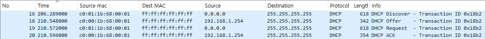

---
title: CCNA 자격증 과정 (8)
date: 2024-04-29 09:00:00 +09:00
categories: [국비, CCNA]
tags: [whireshark, packet tracer, ccna, network]		# TAG는 반드시 소문자로 이루어져야함!
---  

## DHCP

### 패킷분석
- Discover(S->C)
    - 
- Offer(S->C)
- Request(C->S)
- Ack(S->C)

## NAT(Network Address Translation)
- IP/PORT 주소를 변환하는 네트워크 서비스
- NAT 목적 : 보안 & IP 주소 고갈 문제 해결
- NAT는 내부에서 외부로 패키슬 전송하기 위해서 설정하는 것이 아니라 내부에서 외부로 전송된 패킷이 다시 돌아올 수 있도록 하기 위해서 구성

1. NAT 구성 요소
    - Inside(내부, 사설 IP 환경) / Outside(외부, 공인 IP 환경)

    - Inside Local 주소 (Inside 내부에서 사용하는 주소, 사설 IP 주소)
    - Inside Global 주소 (Inside 내부에서 외부로 패킷을 전송할때, 변환되는 IP 주소)

    - Inside -> Outside 로 패킷이 전송될 때 : 출발지 주소 변경
    - Outside -> Inside 로 패킷이 전송될 때 : 목적지 주소 변경

    - NAT 종류
        - Dynamic NAT
        - Static NAT
        - S-NAT: Source NAT
        - D-NAT: Destination NAT

2. 동적 NAT(Dynamic NAT)
    - 사용자 대상으로 NAT를 동적으로 구성(사설 IP)

        [ex] 동적 NAT

    - Inside Local : 192.168.1.0/24
    - Inside Global : 13.13.12.1

3. 정적 NAT(Static NAT)
    - 서버 대상으로 NAT를 정적으로 구성
