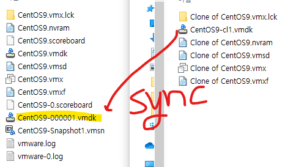

## 목차

1. x86 server virtualization
2. Vmware vSphere
3. Vmware vSphere 가상화 기초 지식
4. Vmware vSphere 테스트 환경 구축
5. vCenter를 이용한  vSphere 관리
6. 호스트간 VM 이동 기술 : VMware Vmotion
7. 데이터 스토어간 VM 이동 기술 : Storage Vmotion
8. vSphere 고가용성
9. vSphere 이용한 서버 통합

# 1. x86 server virtualization

- link clone(종속적) vs Full clone(독립적)
    - Link Clone : WEB server VM을 50개(같은것으로)
    - Full Clone : 현재 VM을 같은 위치에 독립적으로 생성

- 파일 이름
    - vmdk 디스크 : 델타 디스크?
    - vmx 설정화일
    - nvram : 램 파일

- VM export vs VM import
    - VM export
        - OVF (Open virtualization format) : 여러 파일로 구성된 형식
        - OVA (Open Virtualization Appliance) : OVF 파일들을 하나의 패키지로 압축한 형식
    - VM improt : OVF/OVA 형식의 파일을 VMware환경으로 가져와서 새로운 VM을 생성한다.
### 1-1. 실습

HBA, FC 스위치, FC 케이블, 스토리지 장치

thin : 예약해서
thick : 처음부터 하는 방식

호스트 IP : Management Network에 다 들어가 있음 | 물리적 어댑터는 진짜 브릿지 역할