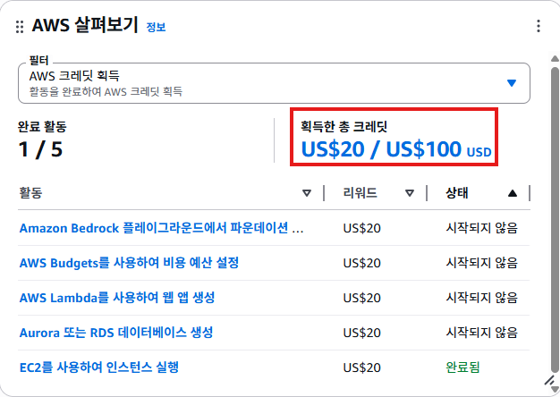

저번에 국비에서 한 e-commerce를 aws를 통해 혼자 구현해보기로 했다.

그 전에 AWS 프리티어 계정 생성과 IAM 계정 생성 및 간단한 테라폼 코드를 만들어서 몸을 풀어볼 예정이다.

AWS 프리티어 계정 정책이 바뀌어서 이전에 프리티어를 썼던 이메일에 라벨을 붙이는 방식으로는 프리티어를 제공받지 못해서 이메일, 카드, 번호를 바꾸고 다시 시도했다.



그러면 사진과 같이 활동을 하면 받을 수 있는 100$의 추가 크레딧이 생긴다. 나는 ec2 vpc를 생성했기 때문에 20$의 크레딧을 획득했다.

루트 사용자로 로그인한 후 보안을 위해 IAM 사용자를 추가했다. 혼자 하는 프로젝트이지만 취업하면 IAM 사용자로도 잘 해야하기 때문이다. 일단 terraform-admin 계정을 하나 만들었다. 또한 루트 사용자는 MFA를 부여하여 이중 보안을 했다. AWS 내에서도 권고하는 사항인 것 같다.

나 혼자 하는 거라 terraform-admin 계정에 FullAccess를 지금은 줘도 되지만 진짜 회사라면 권한을 세분화해서 주는 게 보안상 좋을 것이다.

> 계정이 어떤 권한이 있는지 보는 방법은 AWS에서 제공하는 [IAM Policy Simulator](https://policysim.aws.amazon.com/home/index.jsp?#users)를 통해 알 수 있다.

후에 루트 사용자를 로그아웃하고 terraform-admin 계정으로 로그인 했다.

그 다음 aws cli와 terraform cli를 다운 받고 실행한다. vscode에 HashiCorp Terraform를 다운받는다.

테라폼 용 폴더를 만들고 provider.tf와 vpc를 만들 main.tf를 만든다. 테라폼 코드는 대략 아래와 같다

```terraform
# provider.tf
terraform {
  required_providers {
    aws = {
      source  = "hashicorp/aws"
      version = "~> 5.0"
    }
  }
}

provider "aws" {
  region = "ap-northeast-2" # 서울 리전
}

```

간단한 EC2를 띄우는 작업도 했다. 코드가 길어서 다 첨부하진 않지만 대략 아래와 같은 코드를 사용했다.

1. VPC 생성
2. 인터넷 게이트웨이 만들기(외부 연결)
3. 서브네팅 
4. 라우팅
5. 방화벽
6. 서버 만들기
7. 생성 확인

이 중 6번 단계에서 ami를 불러오는 데에서 ami ID를 직접 쓰는 것보다 data resource를 불러오는 게 더 안정성있다는 것을 배우게 되었다. 또한 인스턴스 별로 쓰는 architecture value(ex. x6_64 or arm64)가 다르다는 것을 알았다.

+ 서브넷을 나누는 이유는 주소범위를 정해줘서 어디서 소통할지 정하는 것과 같다.